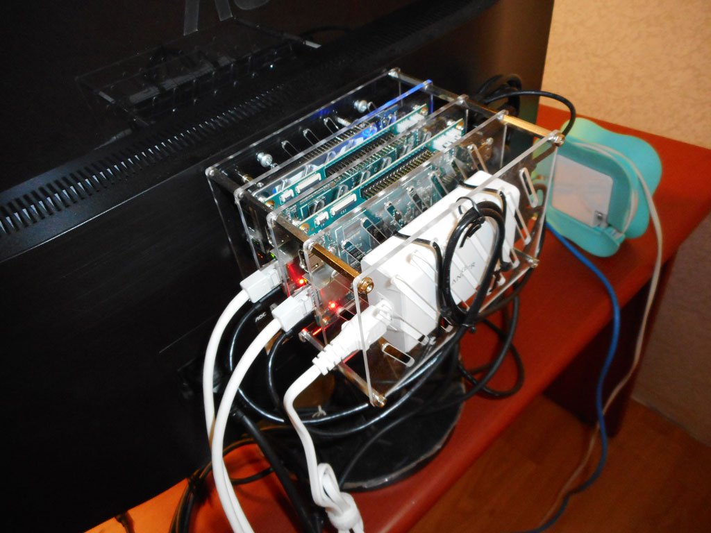
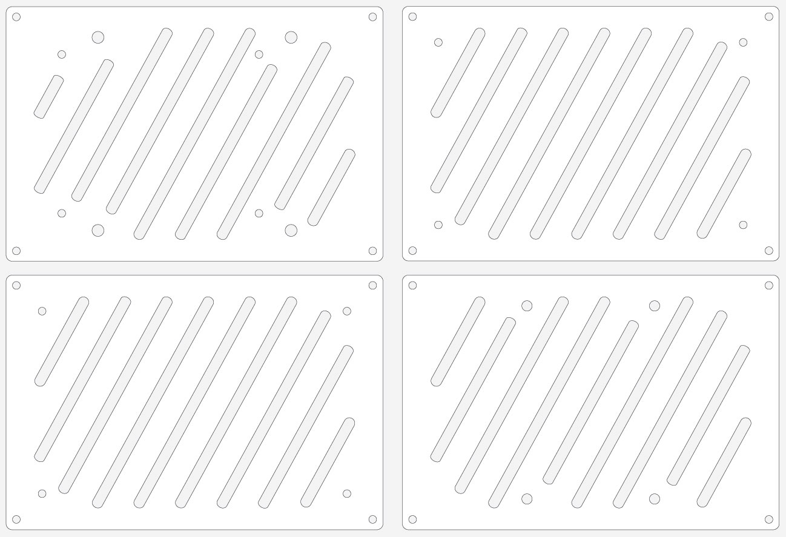

# Pine64 VESA Mount Cluster

This enclosure is to mount at the back of a monitor with VESA compliant support holes.  
You can stack as many as 3 ~ 4 Pine64.

### Cluster Overview

### Layout

## LICENSE  

Copyright 2017. PocketCluster Copyright and related rights are licensed under the Solderpad Hardware License, Version 0.51 (the “License”); you may not use this file except in compliance with the License. You may obtain a copy of the License at http://solderpad.org/licenses/SHL-0.51. Unless required by applicable law or agreed to in writing, software, hardware and materials distributed under this License is distributed on an “AS IS” BASIS, WITHOUT WARRANTIES OR CONDITIONS OF ANY KIND, either express or implied. See the License for the specific language governing permissions and limitations under the License.